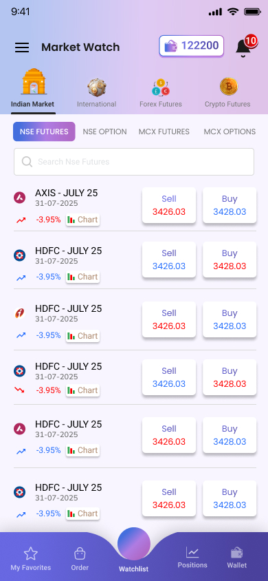

# TradeWatch 📈

<p align="center">
  
</p>

<p align="center">
  <strong>A sleek and modern Flutter application for real-time market data.</strong>
</p>

<p align="center">
  
  
  
</p>

Welcome to **TradeWatch**, a beautifully designed Flutter application that provides real-time market data in an intuitive and visually appealing interface. This project is a showcase of modern Flutter development practices, featuring a clean, scalable architecture and a rich, interactive user experience.

## 📸 Screenshots

*(Here you can add screenshots of the application. For example:)*

| Home Screen | Market Details |
| :---: | :---: |
| *(Image of Home Screen)* | *(Image of Market Details)* |

## ✨ Core Features

- **Real-Time Data:** Get live updates for various financial instruments.
- **Modern & Clean UI:** A visually stunning interface with beautiful gradients, custom SVG icons, and a layout that prioritizes readability.
- **Intuitive Navigation:**
  - Main categories: **Indian Market, International, Forex Futures,** and **Crypto Futures**.
  - Sub-categories: **NSE Futures, NSE Option, MCX Futures,** and **MCX Option**.
- **Dynamic & Interactive Lists:** The market data list shuffles when you switch between tabs, demonstrating reactive state management with BLoC.
- **Robust State Management:** Built with the **BLoC (Business Logic Component)** pattern for a clear separation of business logic from the UI, leading to a more testable and maintainable codebase.
- **Immutable State:** Utilizes the `freezed` package to ensure that all data models and BLoC states are immutable, which helps in creating a predictable state flow.
- **Clean Architecture:** The project is structured into `presentation`, `domain`, and `data` layers, promoting a strong separation of concerns.
- **Custom Widgets:** Features custom-built components like a stylish bottom navigation bar with a center-docked Floating Action Button.

## 🚀 Tech Stack & Architecture

This project is built with a focus on quality and scalability, utilizing a modern Flutter tech stack.

| Category             | Technology / Library                                                                                              |
| -------------------- | ----------------------------------------------------------------------------------------------------------------- |
| **Framework**        | [Flutter](https://flutter.dev/)                                                                                   |
| **State Management** | [flutter_bloc](https://pub.dev/packages/flutter_bloc)                                                             |
| **Code Generation**  | [freezed](https://pub.dev/packages/freezed), [build_runner](https://pub.dev/packages/build_runner)                   |
| **UI**               | Material Design, [flutter_svg](https://pub.dev/packages/flutter_svg), [google_fonts](https://pub.dev/packages/google_fonts) |
| **Linting**          | [flutter_lints](https://pub.dev/packages/flutter_lints)                                                           |

### Architecture Overview

The app follows a clean, layered architecture inspired by Domain-Driven Design (DDD), ensuring the codebase is modular, scalable, and easy to maintain.

- **Presentation Layer (`lib/screens`, `lib/widgets`, `lib/blocs`):** Contains all UI-related components (Widgets) and the state management logic (BLoCs) that drives the UI.
- **Domain Layer (`lib/domain`):** Includes the core business logic and abstract definitions (Use Cases, Repository contracts).
- **Data Layer (`lib/data`):** Responsible for data retrieval and management (Data Source implementations, Repository implementations).

## 🎨 Design & Theming

The application features a modern and clean design to ensure a delightful user experience.

- **Color Scheme:** A striking gradient of deep purples (`#436EDD` to `#AF69C7`) is used for the app bar, creating a vibrant and energetic feel. The primary theme uses this purple gradient contrasted with clean white backgrounds for excellent readability.
- **Typography:** The app uses the `google_fonts` package to create a rich and clear typographic hierarchy.
  - **Headings:** `Oswald` for bold and impactful display text.
  - **Titles:** `Roboto` for clean and readable titles.
  - **Body Text:** `Open Sans` for legible and pleasant body content.
- **Iconography:** Custom SVG icons are used throughout the app to enhance visual communication and provide a polished, professional look.

## 📂 Project Structure

```
lib/
├── blocs/         # BLoC state management files
├── data/          # Data sources and repository implementations
├── domain/        # Core business logic (use cases, repository contracts)
├── models/        # Data models (using Freezed)
├── screens/       # UI for each screen
├── services/      # Business logic services
├── widgets/       # Reusable UI components
└── main.dart      # Application entry point
```

## 🏁 Getting Started

To get a local copy up and running, follow these simple steps.

### Prerequisites

Ensure you have the [Flutter SDK](https://flutter.dev/docs/get-started/install) installed on your machine.

### Installation

1. **Clone the repository:**
   ```sh
   git clone https://github.com/your-username/tradewatch.git
   ```
2. **Navigate to the project directory:**
   ```sh
   cd tradewatch
   ```
3. **Install dependencies:**
   ```sh
   flutter pub get
   ```
4. **Run the code generator:**
   ```sh
   dart run build_runner build --delete-conflicting-outputs
   ```
5. **Run the app:**
   ```sh
   flutter run
   ```

## 🤝 Contributing

Contributions are what make the open-source community such an amazing place to learn, inspire, and create. Any contributions you make are **greatly appreciated**.

If you have a suggestion that would make this better, please fork the repo and create a pull request. You can also simply open an issue with the tag "enhancement".
Don't forget to give the project a star! Thanks again!

1. Fork the Project
2. Create your Feature Branch (`git checkout -b feature/AmazingFeature`)
3. Commit your Changes (`git commit -m 'Add some AmazingFeature'`)
4. Push to the Branch (`git push origin feature/AmazingFeature`)
5. Open a Pull Request

## ⚖️ License

Distributed under the MIT License.

---

<p align="center">
  Made with ❤️ and Flutter
</p>
